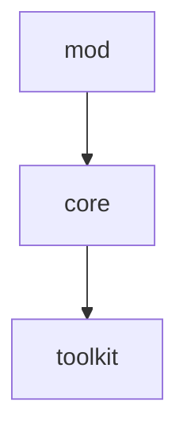

# Архитектура

Здесь будет описана архитектура приложения: слои, их границы и внедрение зависимостей.

Приложение разделено на три слоя, и слой нижнего уровня не знает о слоях выше:

```mermaid
flowchart TD
  mod[mod] --> core[core]
  core --> toolkit[toolkit]
```
